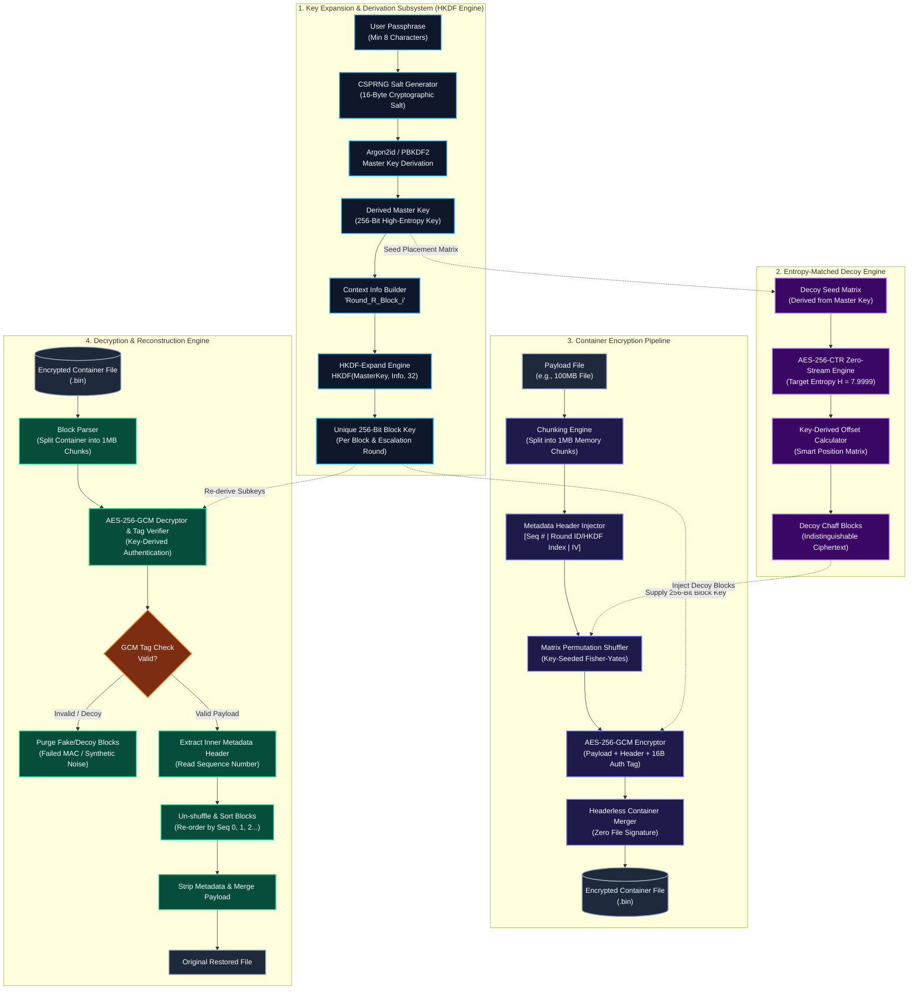

Here is your complete, production-ready `README.md` file. You can copy the raw markdown box below directly into your repository.

---

```markdown
# Zero-Header Secure Container Architecture

An advanced, cryptographically secure, high-entropy container system designed to prevent disk layout profiling, frequency analysis, and metadata leakage. By combining memory-hard key derivation (**Argon2id**), context-bound key expansion (**HKDF-SHA256**), entropy-matched decoy generation, matrix shuffling, and authenticated encryption (**AES-256-GCM**), this system produces zero-header, indistinguishable binary containers (`.bin`).

---

## 🛠️ System Architecture



---

## 🔑 Subsystem Specifications & Pseudocode

### 1. Key Expansion & Derivation Engine

The system uses **Argon2id** for memory-hard passphrase hashing and **HKDF-SHA256 (RFC 5869)** to derive independent, 256-bit symmetric subkeys for every individual block and round.

#### Master Key Derivation

$$K_{\text{master}} = \text{Argon2id}\left(P, S, t=3, m=65536\,\text{KiB}, p=4, L_k=32\right)$$

#### HKDF Subkey Expansion

$$\text{PRK} = \text{HKDF-Extract}\left(S, K_{\text{master}}\right)$$

$$\text{Info}_{R, i} = \text{"Round\_"} \parallel \text{ToString}(R) \parallel \text{"\_Block\_"} \parallel \text{ToString}(i)$$

$$K_{R, i} = \text{HKDF-Expand}\left(\text{PRK}, \text{Info}_{R, i}, 32\right)$$

```text
Algorithm DeriveBlockKeys
Inputs: Passphrase P, Salt S, TotalBlocks N, MaxRounds R_max
Output: Key Map K[R][i]

1. PRK <- HKDF_Extract(S, Argon2id(P, S, t=3, m=65536, p=4, L=32))
2. For R = 1 to R_max do:
3.     For i = 0 to N - 1 do:
4.         Info <- Concatenate("Round_", ToString(R), "_Block_", ToString(i))
5.         K[R][i] <- HKDF_Expand(PRK, Info, 32)
6.     End For
7. End For
8. Return K

```

---

### 2. Entropy-Matched Decoy Engine

To prevent statistical analysis from revealing real block boundaries, fake blocks are generated using an AES-256-CTR zero-stream pseudorandom function (PRF), matching the byte frequency distribution of high-entropy ciphertext ($H \approx 7.9999$).

#### Shannon Entropy Formula

$$H(X) = -\sum_{x \in \Sigma} P(x) \log_2 P(x)$$

#### Decoy Stream Function

$$D_j = \text{AES-256-CTR}\left(K_{\text{decoy}}, \text{CTR}_j, \mathbf{0}^{M}\right)$$

```text
Algorithm GenerateDecoyBlocks
Inputs: PRK, DecoyCount NumDecoys, BlockSize M
Output: Decoy Array DecoyArray

1. K_decoy <- HKDF_Expand(PRK, "Decoy_Seed_Matrix", 32)
2. ZeroBuffer <- Array of size M filled with 0x00
3. For j = 0 to NumDecoys - 1 do:
4.     IV_j <- DeriveIV(K_decoy, j)
5.     DecoyArray[j] <- AES_256_CTR_Encrypt(K_decoy, IV_j, ZeroBuffer)
6. End For
7. Return DecoyArray

```

---

### 3. Container Encryption Pipeline

Files are split into $1\,\text{MB}$ memory chunks, prepended with inner metadata, shuffled via a key-seeded Fisher-Yates matrix permutation, and authenticated using AES-256-GCM.

#### Block Metadata Header Construction

$$h_i = \text{SeqNum}_i \parallel \text{RoundID}_i \parallel \text{IV}_i$$

$$B_i^{\text{meta}} = h_i \parallel B_i^{\text{raw}}$$

#### AES-256-GCM Authenticated Encryption

$$(C_k, T_k) = \text{AES-256-GCM-Encrypt}\left(K_{R, k}, \text{IV}_k, V[k]\right)$$

$$E_k = C_k \parallel T_k$$

```text
Algorithm EncryptContainer
Inputs: PayloadFile F, Passphrase P, Salt S, DecoyCount NumDecoys
Output: Headerless Binary Container C_final

1. Chunks[] <- Split F into 1MB blocks
2. For i = 0 to length(Chunks) - 1 do:
3.     Header_i <- BuildHeader(SeqNum=i, RoundID=1, IV=CSPRNG(12))
4.     RealBlocks[i] <- Header_i || Chunks[i]
5. End For
6. DecoyBlocks <- GenerateDecoyBlocks(PRK, NumDecoys, BlockSize=1MB + |Header|)
7. UnifiedArray <- RealBlocks U DecoyBlocks
8. Seed_shuffle <- HKDF_Expand(PRK, "Matrix_Permutation_Seed", 32)
9. PermutedArray <- KeyedFisherYatesShuffle(UnifiedArray, Seed_shuffle)
10. For k = 0 to length(PermutedArray) - 1 do:
11.    K_k <- HKDF_Expand(PRK, BuildInfo(k), 32)
12.    EncryptedBlocks[k] <- AES_256_GCM_Encrypt(K_k, IV_k, PermutedArray[k])
13. End For
14. C_final <- Concatenate(EncryptedBlocks)
15. Return C_final

```

---

### 4. Decryption & Reconstruction Engine

During decryption, every chunk is parsed and tested against AES-256-GCM authentication tag verification. Real blocks authenticate successfully and yield valid sequence headers; fake blocks fail authentication and are purged automatically.

#### Decoy Purging Decision Rule

$$\mathbb{I}(V'_k) = \begin{cases}  1 & \text{if } \text{GCM-Tag-Verify}(T_k) = \text{VALID} \quad (\text{Real Block}) \\  0 & \text{if } \text{GCM-Tag-Verify}(T_k) = \text{INVALID} \quad (\text{Decoy Purged})  \end{cases}$$

```text
Algorithm DecryptAndReconstruct
Inputs: EncryptedContainer C_final, Passphrase P, Salt S
Output: Restored File F

1. PRK <- HKDF_Extract(S, Argon2id(P, S, t=3, m=65536, p=4, L=32))
2. Chunks[] <- Split C_final into 1MB + Header + 16B_Tag chunks
3. RealBlocks <- Empty List

4. For k = 0 to length(Chunks) - 1 do:
5.     K_sub <- HKDF_Expand(PRK, BuildInfo("Round_1_Block_", k), 32)
6.     Plaintext, TagStatus <- AES_256_GCM_Decrypt(K_sub, Chunks[k])
7.     
8.     If TagStatus == VALID then:
9.         Header, RawData <- ExtractHeader(Plaintext)
10.        RealBlocks.Append({SeqNum: Header.SeqNum, Data: RawData})
11.    Else:
12.        Discard Chunks[k] // Synthetic decoy purged
13.    End If
14. End For

15. Sort RealBlocks ascending by SeqNum
16. F <- Concatenate(RealBlocks.Data)
17. Return F

```

---

## 🛡️ Security Analysis & Performance Matrix

| Security Parameter | Mechanism | Security Benefit |
| --- | --- | --- |
| **Passphrase Security** | Argon2id ($64\,\text{MB}$ RAM, 3 iterations) | High resistance to GPU/ASIC acceleration |
| **Key Diversification** | HKDF-SHA256 Context Binding | Eliminates multi-block key reuse vulnerabilities |
| **Layout Obfuscation** | Key-Seeded Fisher-Yates Matrix Shuffle | $N!$ permutation combinations |
| **Disk Forensics Defense** | Internal Inner Metadata Headers | Zero unencrypted magic bytes or headers on disk |
| **Tamper Resistance** | AES-256-GCM 128-bit MAC Tags | Detects ciphertext modifications or corruption |
| **Entropy Profiling** | AES-256-CTR Synthetic Chaff ($H \approx 7.9999$) | Prevents file boundary detection via entropy scans |

---


```
